#  Itinerary app
This app created following the online tutorial by Mark Moeykens from Big Mountain Studios.
###  Main screen.

  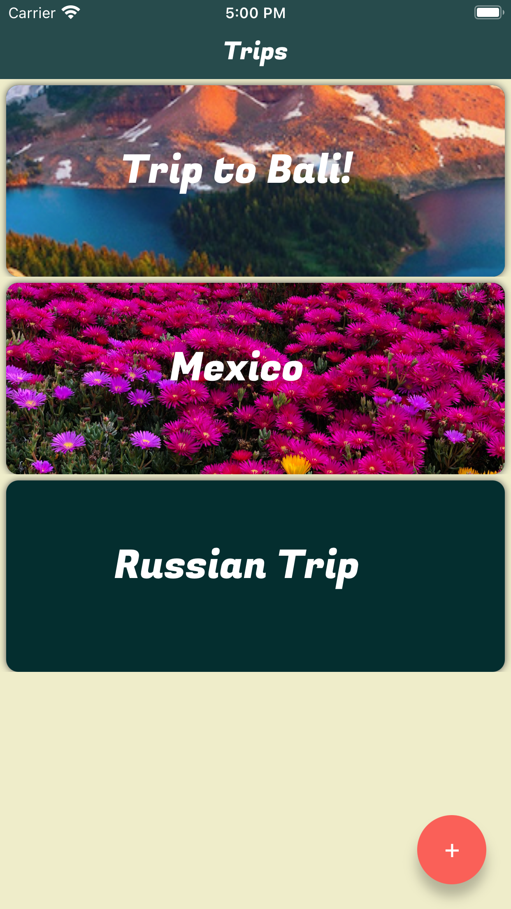

At the first launch of the app, you will see a help screen (the information about this, we save in UserDefaults). 

  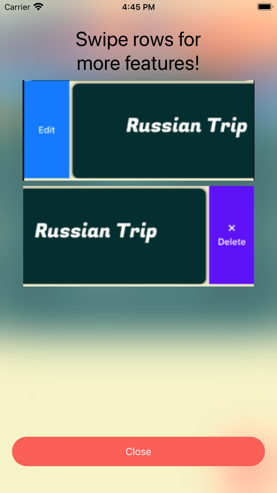

On the main screen, you can create new notes for your trips. If you do something wrong, you can always change this after.

  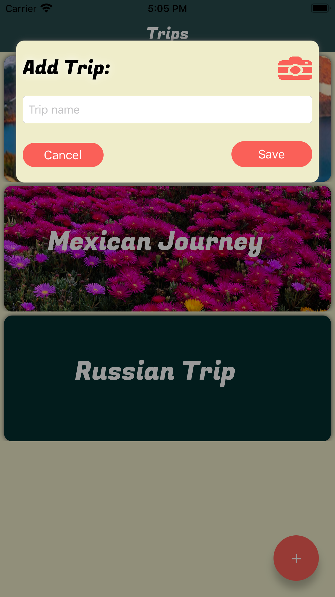
  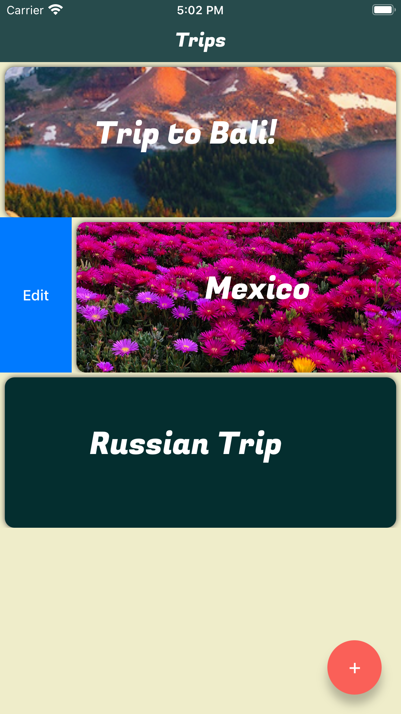  
  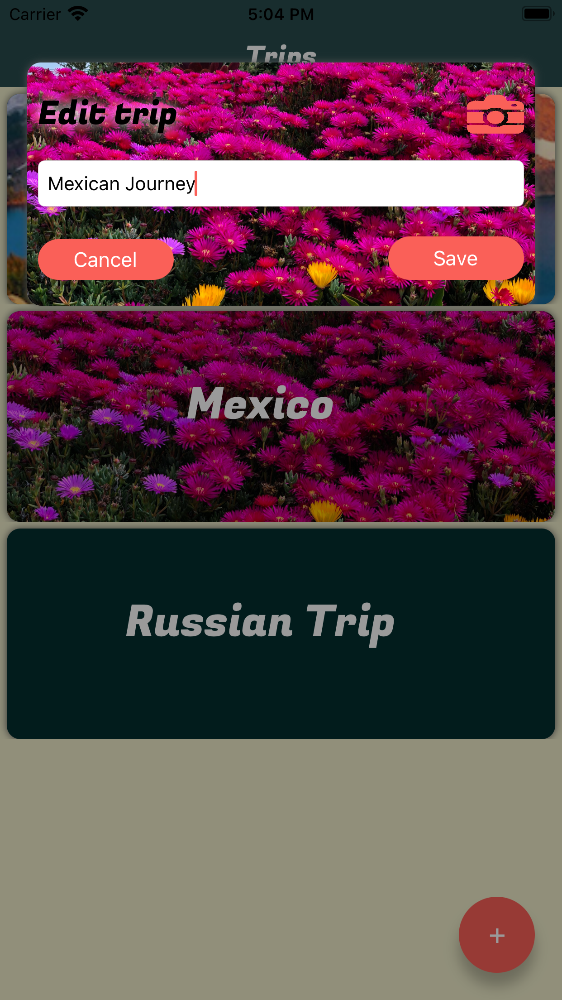

### Activities screen.

  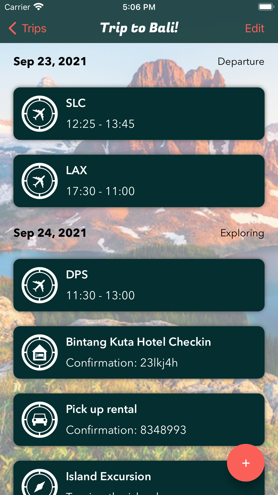

On this screen, you can create a new day, filling it with important things to do. Again, if you misspelled something or do something wrong, you can change it or delete it, don't worry ;)

  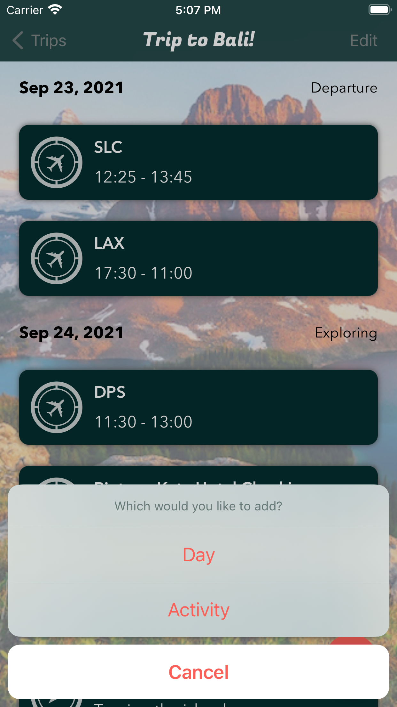  
  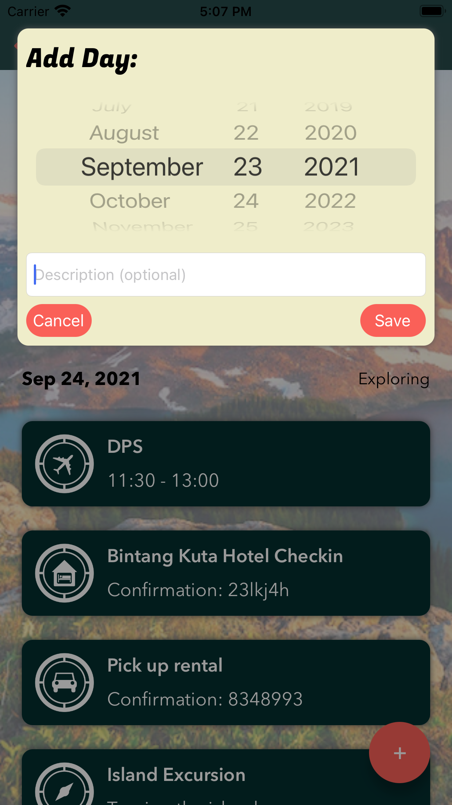
  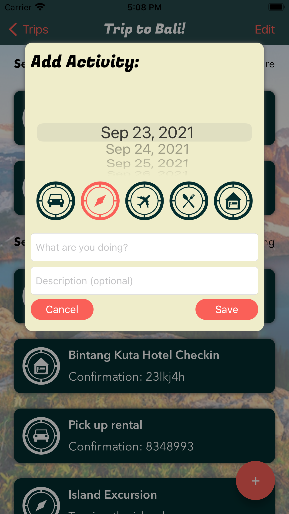
  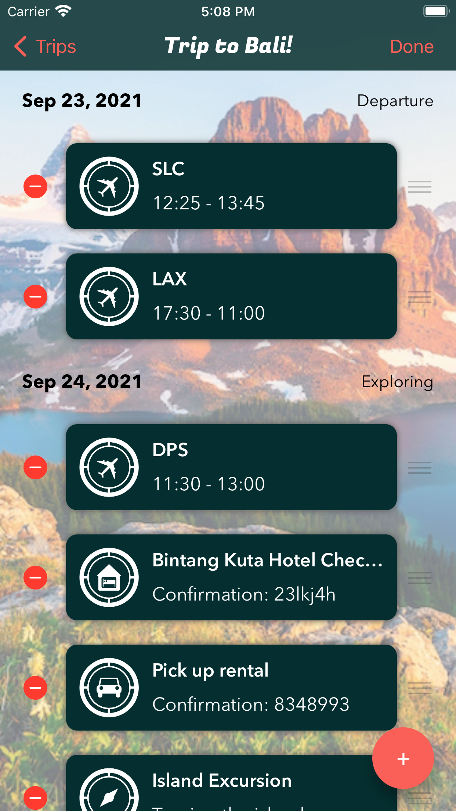
  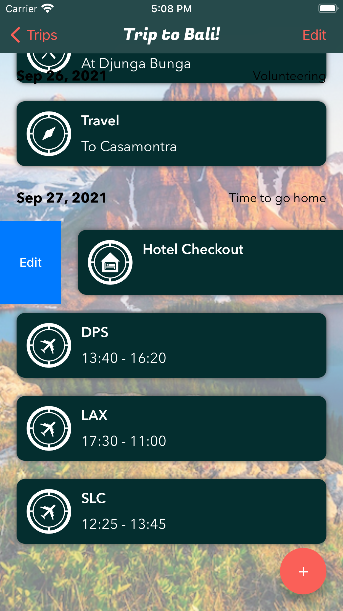
  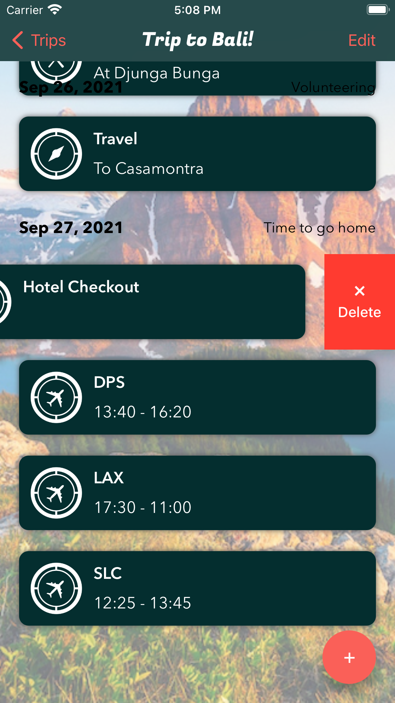  

